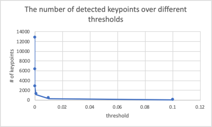

# Interest point (Keypoint) Detection

`harris_points_detector` is implemented at lines 17-70 in `identify_kps.py`.  Here,
reflective image padding is implemented by choosing `mode=reflect` whenever we call any `scipy`'s 
filter functions (i.e. `sobel`, `convolve` and `maximum_filter`). The horizontal &
vertical partial derivatives, `image_dx`  and `image_dy`, are calculated by convolving the input image with
a `sobel` filter. With this, we subsequently compute the components of the harris matrix: `Ixx`, `Iyy` and `Ixy`.
We then compute the corner response, `corner_mat`,  using a 7 by 7 `getGaussianKernel` of 0.5 sigma.

0.000001(12683) | 0.0001(2763) | **0.01(283)** - optimal
--- | --- | ---
{width=200px} | {width=200px} | {width=200px}

Table: The detected keypoints with varying thresholds. The numbers in the parenthesis represent the total number of detected points.

{width=350px}

The strongest keypoints (i.e. interest points) are found by thresholding the local maxima of `corner_mat`.
As **Table 1** illustrates, we keep increasing the threshold until we have only a few off-the-bernie points. For instance,
we increase the threshold from `0.000001` all the way up to `0.01`, because many of 12683 keypoints in the former case
reside at the staircase, whereas we see only a few keypoints residing at the staircase in the latter case. As a result of this process,
we reach an optimal value of **0.01** for the threshold (the rightmost bernie in **Table 1**). Though possible, we do not further optimise 
from this value because the number of keypoints exponentially decreases as the threshold increases (**Figure 1**);
raising the threshold would only so much improve the result.

# Feature Matching

## Implement sum of squared distances to measure Local Feature similarity and ratio test to discard points that will give ambiguous matches 
- this is implemented at ... in `match_bernie.py`

## Calculate ORB Local features (using ORB descriptor) for your detected interest points.
- this is implemented at ... in `match_bernie.py`

## Compare it with built-in ORB features 
- we show the comparison below.
- some good: 
- some bad: the noisy ones.

harris corner detector | ORB's built-in `detect`
--- | ---
{width=300px} | {width=300px}
 {width=300px} | {width=300px}
 {width=300px} | {width=300px} 
 {width=300px} |  {width=300px}
{width=300px} | {width=300px}
{width=300px} |  {width=300px}
 {width=300px} |  {width=300px}
{width=300px} | {width=300px}
 {width=300px} | {width=300px}

