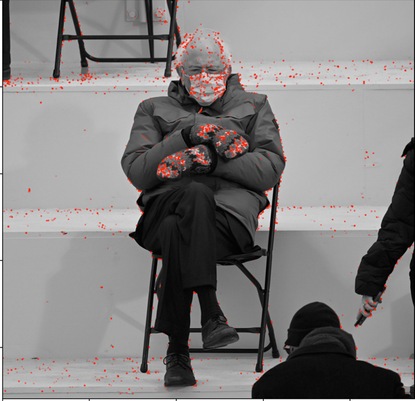

## 22nd of May, 2021

- deadline is noon, tomorrow. 
- then, you complete the math.

as of right now, we better understand what's going on.

## 25th of May, 2021

spend no more than 4 hours.

1. Reserve this for understanding the concepts needed
  1. task1, task2, task3 - write questions
  2. answer the questions, by referencing the lectures.
2. Implement the tasks - 1 
  1. 
  2.
3. Implement the tasks - 2 
  1.
  2.
4. Reserve this for writing the report.
  1.
  2.

## 26th of May

spend no more than 5 hours. 
reserve an hour and a half for writing the report.

1. task 2 - the feature descriptor.

2. task 3 - the matcher.

3. task 1 - just check that this works. 

here, we are logging the difference as we vary the threshold:

when thresh_pre = 0.01
thresh_post =  2171468424.176
the image:

when thresh_pre = 0.1
thresh_post = 21714684241.760002
the image:

when thresh_pre = 0.15
thresh_post = 32572026362.64
the image:

when thresh_pre = 0.2 <- this seems alright.
thresh_post = 43429368483.520004
the image: 

when thresh_pre = 0.3
thresh_post = 65144052725.28
the image: 
