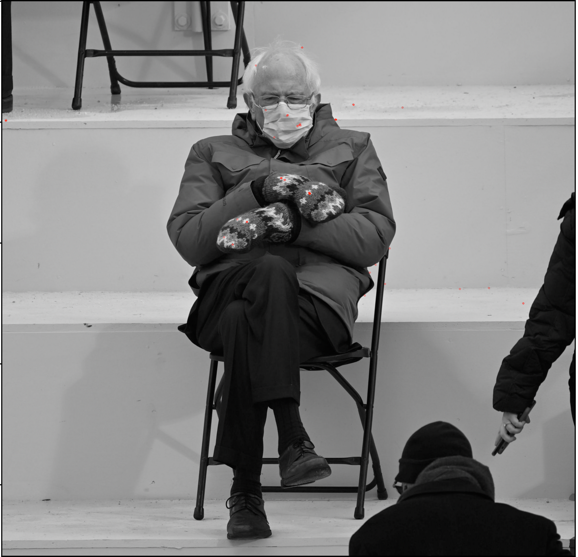
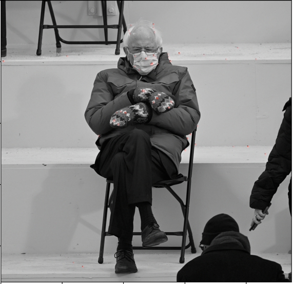
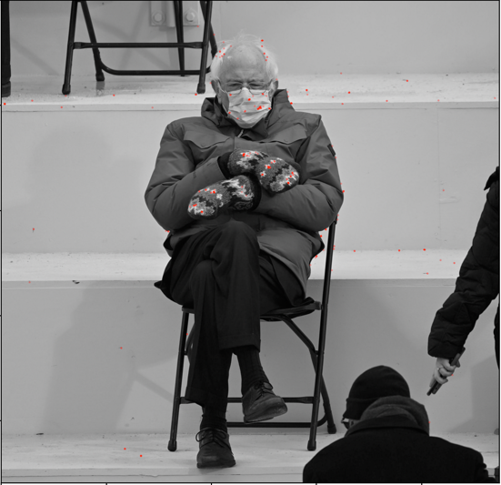
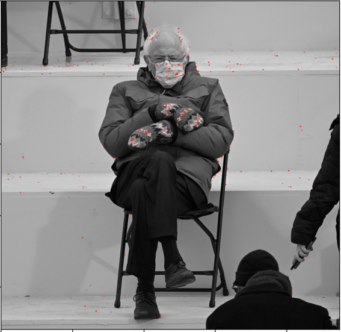
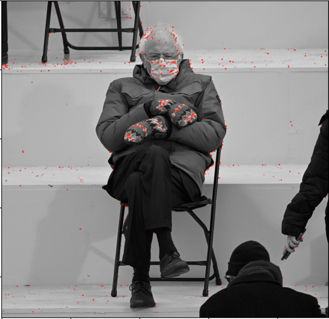
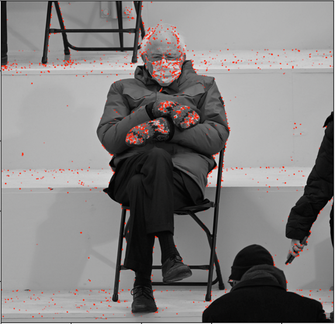

image | thresh | kps
--- | --- | ---
 | max * 0.6 = 130288105450.56 | 62
 | max * 0.5 = 108573421208 | 151 
 | max * 0.4 = 86858736967 | 346
 | max * 0.3 = 65144052725 | 797
 | max * 0.2 = 43429368483 | 2003
 | max * 0.1 = 21714684241| 5508

the number of key points decreases exponentially.
what is the best one? -> only leaving out the corners on the gloves would be much better. 

the optimal value is max * 0.5. Because it has the least off-the-bernie spots.
