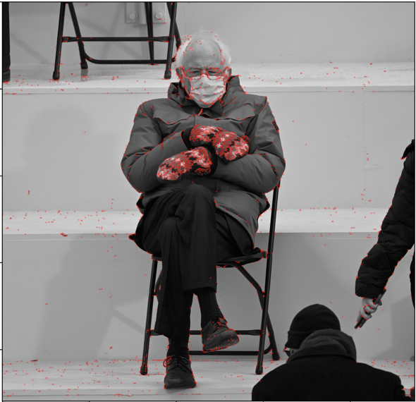
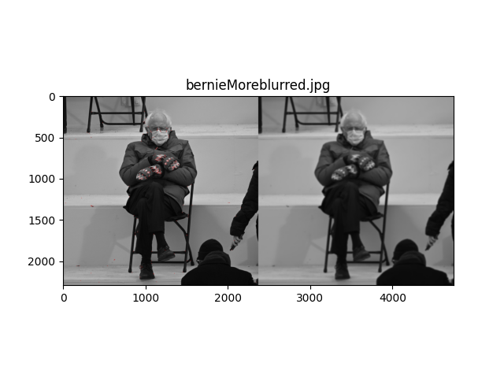
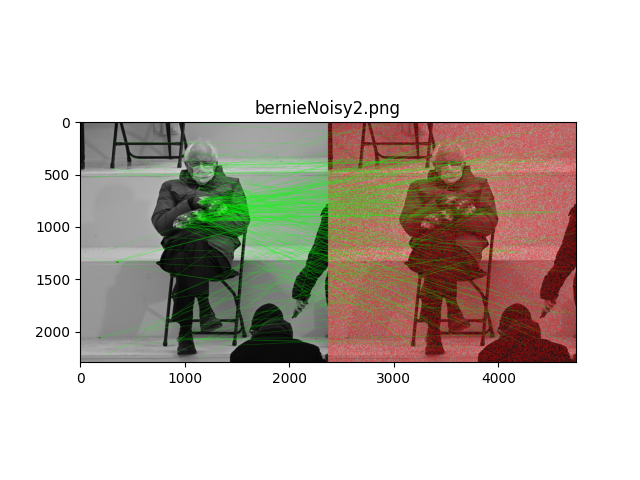
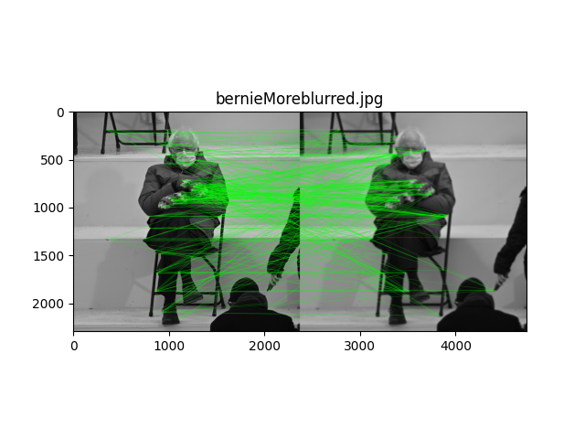

## Harris Corner detection

image | thresh | kps
--- | --- | ---
 | 0.1 | 12
 | 0.01 | 283
 | 0.001 | 1169
 | 0.0001 | 2763
 | 0.00001 | 6195
 | 0.000001 | 12683

the plot:

- x: threshold
- y: number of kps.
- exponential drop.

## Feature Matching

### with harris corner

ssd | ratio
--- | --- 
 | 
 | 
 | 
 | 
 |
 |
 | 
 |
 | 

you might also want to find out the differences in the number of matches...

### with orb

ssd | ratio
--- | ---
 | 
 | 
 |  
 | 
 | 
 | 
 | 
 | 
 | 