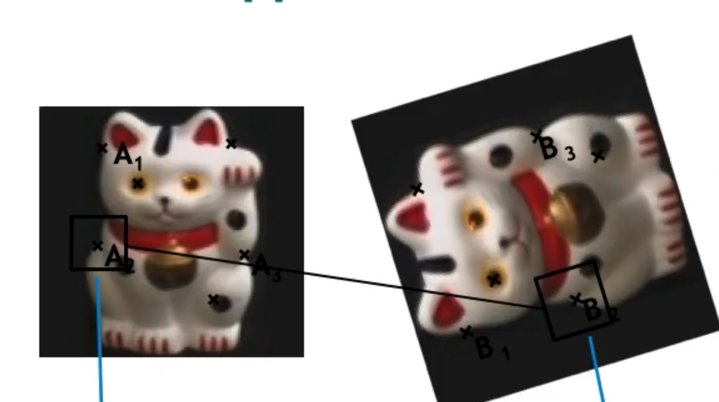

## The coursework

> What is this about?

It is about "local feature detection & matching". 
But I still don't understand what this means.

> Any examples of "local feature detection & matching?"

Take face recognition for instance.
learning the features of a face from training data -> this would learn
the "global features" of the face. Though this works fairly well, but it can't handle
some edge cases (but quite often), like occlusion (e.g. a face occluded by a megazine)

How do we deal with that? We can try extracting local features.

## task 1 - feature detection (2 + 1 + 2 + 2 + 2 = 9 marks. 60% of the mark is this task.

> What am I supposed to do?

1. **Identify** interest points in the image (bernie) with Haris Corner detection algo.
  - Implement `HarrisCornerDetector`. (2 marks)
  - Use 3 by 3 Sobel operator to compute x and y derivatives at point p (2 marks)
  - Use of reflective image padding (1 mark)
    - for pixels **outside** the image, pad the image using "reflection".
  - find corner response c(M) for every image pixel (using Gaussian window)  (2 marks)
    - Use a 5 by 5 gaussian mask with 0.5 sigma to have w_p be "circularly symmetric".
2. **Select** the strongest interest points, via a threshold and local maxima operations. (2 marks)

> What are "interest points"?

It's just a location. It's not a region.
They are candidate locations - the area surrounding them
has **rich information**.

> What is a "Harris" detector?

It is a detector that can find interest points.
It attempts to solve the follwing two problems;
1. detect the same points *independently* in images (it should be a repeatable detector)
  - so, we detect corners. because they are repeatale points for matching.

## task 2 - feature description

> What am I supposed to do?

1. **create** a descriptor .... ; implement `featureDescriptor` function.
2. **compare** the performance achieved by the ORB `compute` function.

## task 3 - feature matching

> What am I supped to do?

1. **Match** the images.. ; implement `matchFeatures` function of `SSDFeatureMatcher` and `RatioFeatureMatcher`.
   - i.e. given a feature in one image, find the best matching feature in another image. 
2. 