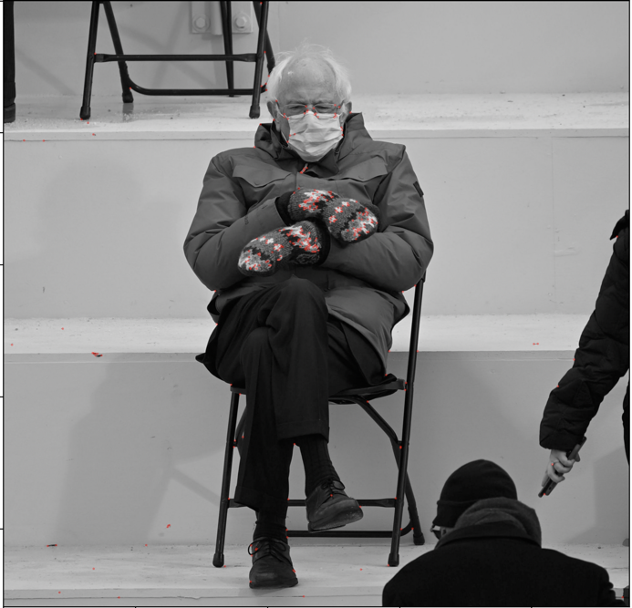
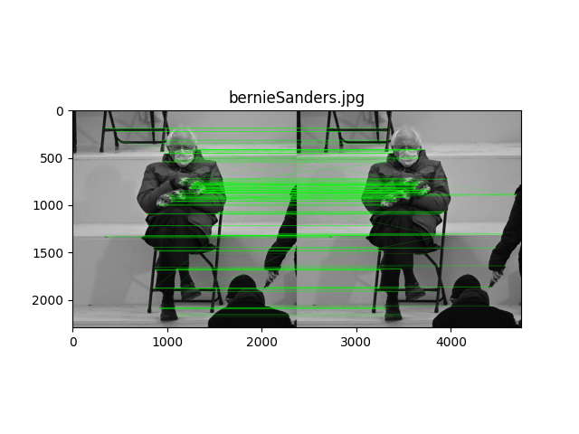

# Interest point (Keypoint) Detection

`harris_points_detector` is implemented at lines 17-70 in `identify_kps.py`.  Here,
reflective image padding is implemented by choosing `mode=reflect` whenever we call any `scipy`'s 
filter functions (i.e. `sobel`, `convolve` and `maximum_filter`). The horizontal &
vertical partial derivatives, `image_dx`  and `image_dy`, are calculated by convolving the input image with
a `sobel` filter. With this, we subsequently compute the components of the harris matrix: `Ixx`, `Iyy` and `Ixy`.
We then compute the corner response, `corner_mat`,  using a 7 by 7 `getGaussianKernel` of 0.5 sigma.

0.000001(12683) | 0.0001(2763) | **0.01(283)** - optimal
--- | --- | ---
{width=200px} | {width=200px} | {width=200px}

Table: The detected keypoints with varying thresholds. The numbers in the parenthesis represent the total number of detected points.

{width=350px}

The strongest keypoints (i.e. interest points) are found by thresholding the local maxima of `corner_mat`.
As **Table 1** illustrates, we keep increasing the threshold until we have only a few off-the-bernie points. For instance,
we increase the threshold from `0.000001` all the way up to `0.01`, because many of 12683 keypoints in the former case
reside at the staircase, whereas we see only a few keypoints residing at the staircase in the latter case. As a result of this process,
we reach an optimal value of **0.01** for the threshold (the rightmost bernie in **Table 1**). Though possible, we do not further optimise 
from this value because the number of keypoints exponentially decreases as the threshold increases (**Figure 1**);
raising the threshold would only so much improve the result.

# Feature Matching

Measuring local feature similarity between `bernie.jpeg` and its variations (e.g. `bernie180.jpg`, `bernieMoreblurred.jpg`, etc)
is implemented in `match_bernie.py`. Measuring the similarity with respect to the sum of squared distance between 
two descriptor vectors is implemented with `SSDFeatureMatcher` class, at lines 27-38. Measuring the similarity
with respect to $\frac{min ssd distance}{second min ssd distance}$ is implemented with `RatioFeatureMatcher` class, at lines 41-56.
The method to use for extracting keypoints is parameterized with `extract_kps` function(lines 83-94). That is, when `mode` is `harris`,
it extracts the keypoints of an image with the self-implemented `harris_points_detector` function, but when `mode` is `orb`, it extracts
them with ORB's built-in `detect` function.

ORB's built-in `detect` matches the variations with the original better than the self-implemented `harris_points_detector`.
ORB is especially more robust to noisy and blurred images than the other, as can be seen in  **Table 2**. Here, the green lines 
and the red dots denote the matches that have been found and the keypoints that have not been matched with anything, respectively.
We can see that `harris_points_dector` were unable to detect any keypoints in `bernieMoreBlurred.jpg`, and thus no matches
 were found at all. As for noisy images (e.g. `bernieNoisy2.png` and `berniePixelated2.png`),
it detects so many keypoints that the matches are poorly marred (i.e. there are no horizontal green lines although the orientations
are the same). In contrast, ORB's `detect` reliably detect keypoints even when images are blurred or noised, and thus better matches the images.

`haris_points_detector` | ORB's built-in `detect`
--- | ---
{width=300px} | {width=300px}
 {width=300px} | {width=300px}
 {width=300px} | {width=300px} 
 {width=300px} |  {width=300px}
{width=300px} | {width=300px}
{width=300px} |  {width=300px}
 {width=300px} |  {width=300px}
{width=300px} | {width=300px}
 {width=300px} | {width=300px}

Table: The matching results of the self-implemented `harris_points_detector` and ORB's built-in `detect`. `ratio` is 
used for the similarity measure.
